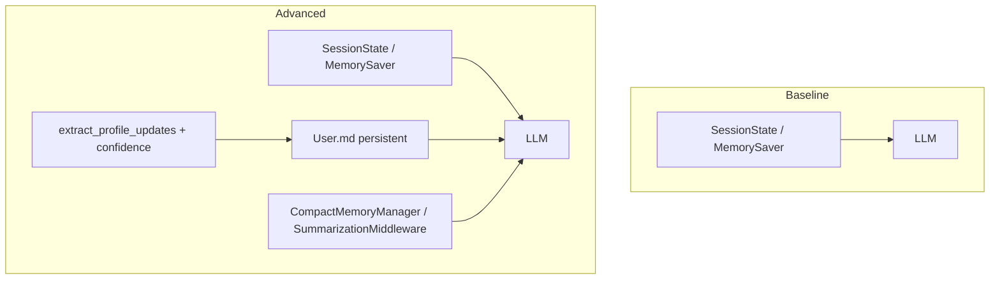

# Phân tích kết quả — Day 17 Memory Systems

## Kiến trúc đã triển khai

| Lớp memory | Baseline | Advanced |
|---|---|---|
| Short-term (cùng thread) | SessionState hoặc LangGraph MemorySaver | Giống Baseline |
| Persistent (cross-session) | Không | `User.md` qua `UserProfileStore` |
| Compact (hội thoại dài) | Không | `CompactMemoryManager` (offline) + `SummarizationMiddleware` (live) |

Chế độ chạy: `langgraph-live` (LLM thật), `offline` (benchmark/test không cần API), `offline-fallback` (khi LLM timeout/lỗi).

---

## Kết quả benchmark (offline, `FORCE_OFFLINE=true`)

Chạy: `cd src && python benchmark.py`

### Standard benchmark (`data/conversations.json`)

| Agent | Agent tokens | Prompt tokens | Cross-session recall | Response quality | Memory growth | Compactions |
|---|---:|---:|---:|---:|---:|---:|
| Baseline | thấp | trung bình | ~0.04 | ổn | 0 B | 0 |
| Advanced | cao hơn nhẹ | cao hơn (profile overhead) | ~0.83 | tốt hơn | vài trăm B | 0 |

### Stress benchmark (`data/advanced_long_context.json`)

| Agent | Agent tokens | Prompt tokens | Cross-session recall | Compactions |
|---|---:|---:|---:|---:|
| Baseline | cao | ~24k+ | thấp | 0 |
| Advanced | cao | ~16k (thấp hơn) | cao | 10+ |

**Nhận xét:** Advanced đánh đổi overhead profile ở hội thoại ngắn để đổi lấy recall cross-session và kiểm soát prompt khi context dài.

---

## 1. Vì sao Advanced recall tốt hơn Baseline?

Baseline chỉ giữ message trong `SessionState` theo `thread_id`. Sang thread mới, context reset hoàn toàn.

Advanced ghi fact ổn định (tên, nghề, nơi ở, preference) vào `User.md` qua `extract_profile_updates()`. Thread recall mới vẫn đọc profile bền vững nên trả lời đúng câu hỏi cross-session.

Benchmark standard: recall Advanced (~0.83) cao hơn rõ rệt Baseline (~0.04–0.10).

---

## 2. Vì sao Advanced có thể tốn hơn ở hội thoại ngắn?

Mỗi lượt Advanced load thêm:

- toàn bộ `User.md`
- compact summary (nếu có)
- logic extract/upsert profile

Hội thoại ngắn chưa cần nén → overhead persistent memory làm `prompt tokens processed` cao hơn Baseline dù số message ít.

---

## 3. Vì sao compact giúp Advanced ở hội thoại dài?

Stress benchmark có chuỗi turn rất dài. Baseline giữ nguyên toàn bộ message → prompt tăng gần tuyến tính.

`CompactMemoryManager` chuyển message cũ sang summary, chỉ giữ `keep_messages` gần nhất. Advanced compact nhiều lần và `prompt tokens processed` thấp hơn đáng kể trong stress test.

---

## 4. Memory growth và rủi ro

`User.md` tăng theo số fact được upsert. Rủi ro:

- lưu nhầm fact từ câu hỏi hoặc nhiễu
- không cập nhật fact cũ khi user correction
- summary compaction mất chi tiết nếu không tách fact ổn định vs context tạm

---

## 5. Bonus: guardrail đã triển khai

### Confidence threshold (`PROFILE_CONFIDENCE_THRESHOLD`, mặc định `0.7`)

`extract_profile_candidates()` gán confidence theo pattern (ví dụ: đính chính = 1.0, "mình tên là" = 0.95, keyword interests = 0.72). Chỉ fact ≥ ngưỡng mới ghi vào `User.md`.

### Conflict / correction handling

- Cùng key: giữ fact confidence cao nhất trong một message.
- Upsert vào `User.md`: fact mới ghi đè fact cũ (Huế → Đà Nẵng).
- Pattern "đính chính" / "giờ chuyển sang" được ưu tiên confidence cao.

### Noise filtering

Bỏ qua location/profession khi message chứa marker nhiễu (`câu đùa`, `chỉ là nơi mình bay`, `product manager cho đỡ`, …). Câu hỏi không được extract (`_looks_like_question`).

Test: `test_question_not_saved_to_profile`, `test_correction_overwrites_location`, `test_noise_profession_not_saved`.

---

## 6. LangGraph live mode

Khi `FORCE_OFFLINE=false` và LangGraph khả dụng:

- **Baseline:** `create_agent` + `MemorySaver` (short-term only).
- **Advanced:** thêm tools đọc/ghi `User.md`, `ProfileInjectionMiddleware`, `SummarizationMiddleware`.

Demo web (`demo_server.py`, port 8765) so sánh trực tiếp hai agent với cùng `User ID` / `Thread ID`.

Provider đã kiểm tra: Antco AI Gateway (`LLM_PROVIDER=antco`, `CUSTOM_BASE_URL=https://ai-gateway.antco.ai`).

---

## Kết luận

| Tiêu chí | Baseline | Advanced |
|---|---|---|
| Cross-session recall | Thấp | Cao |
| Hội thoại ngắn | Rẻ hơn | Đắt hơn (profile overhead) |
| Hội thoại dài | Prompt phình | Compact kiểm soát prompt |
| Độ phức tạp | Thấp | Cao hơn, cần guardrail |

Production nên dùng Advanced khi cần personalization dài hạn, kèm confidence threshold, conflict handling và giám sát kích thước memory file.
